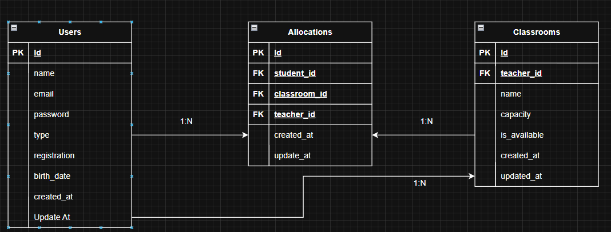

# School Classroom Management API

This is a **RESTful API** for a school management system built using **AdonisJS (Node.js + TypeScript)**. It allows **teachers** to register classrooms and **allocate students** to them. The application uses **MySQL** for data storage and **JWT** for authentication.

## Database



## Requiriments

- Node.js `>=18`
- MySQL `>=5.7`
- npm or yarn

## Features

- Student and teacher management
- Classroom allocation system
- JWT Authentication
- Capacity control and availability
- MySQL database with Lucid ORM

## Tech Stack

- Framework: AdonisJS (v6)
- Language: TypeScript
- Database: MySQL
- ORM: Lucid ORM
- Authentication: JWT (manual)
- Validation: Vine.js
- Password Hashing: Scrypt
- UUIDs for model IDs

### 📦 Installation

```bash
git clone https://github.com/RenanFrancaDev/school_system-api.git
cd school-api

npm install
```

- Create and configure .env as .env.example

```bash
node ace migration:run
npm run dev
```

## Features

#### Teachers

Can create, update, and delete classrooms
Can allocate students to classrooms
Can list students in their classrooms

#### Students

Can register and login
Can view which classroom they are assigned to

## Authentication

Secure login via JWT
Get current user (/auth/me)
Logout (handled client-side)
Change password

# 📚 API Routes

## 🔐 Auth Routes

| Method | Endpoint             | Auth | Description               |
| ------ | -------------------- | ---- | ------------------------- |
| POST   | `/api/auth/register` | ❌   | Register a new user       |
| POST   | `/api/auth/login`    | ❌   | Login and receive a token |
| GET    | `/api/auth/me`       | ✅   | Get logged-in user info   |
| POST   | `/api/auth/logout`   | ✅   | Logout current session    |

---

## User Routes

| Method | Endpoint                    | Auth | Description                          |
| ------ | --------------------------- | ---- | ------------------------------------ |
| GET    | `/api/users`                | ✅   | List all users (paginated)           |
| GET    | `/api/users/:id`            | ✅   | Get user by ID                       |
| PUT    | `/api/users/:id`            | ✅   | Update own user profile              |
| DELETE | `/api/users/:id`            | ✅   | Delete own account                   |
| GET    | `/api/users/:id/classrooms` | ✅   | Get classrooms assigned to a student |
| PUT    | `/api/users/password`       | ✅   | Change user password                 |

---

## Classroom Routes

| Method | Endpoint                       | Auth | Description                                 |
| ------ | ------------------------------ | ---- | ------------------------------------------- |
| GET    | `/api/classrooms`              | ✅   | List all classrooms (with optional filters) |
| GET    | `/api/classrooms/:id`          | ✅   | Get classroom by ID                         |
| POST   | `/api/classrooms`              | ✅   | Create classroom (teachers only)            |
| PUT    | `/api/classrooms/:id`          | ✅   | Update classroom (only owner teacher)       |
| DELETE | `/api/classrooms/:id`          | ✅   | Delete classroom (only owner teacher)       |
| GET    | `/api/classrooms/:id/students` | ✅   | List all students in a classroom            |

---

## Allocation Routes

| Method | Endpoint               | Auth | Description                       |
| ------ | ---------------------- | ---- | --------------------------------- |
| POST   | `/api/allocations`     | ✅   | Allocate a student to a classroom |
| DELETE | `/api/allocations/:id` | ✅   | Remove student from classroom     |

---

## Legend

- ✅ = Requires JWT token (Bearer Token in `Authorization` header)
- ❌ = Public route (no authentication required)

## API Testing with Insomnia

A full workspace is available in the Insomnia.yaml file at the root of the project.

#### How to Import

Open Insomnia
Click on Import/Export → Import Data → From File
Select the file: Insomnia.yaml
You’ll see all the endpoints grouped and ready to use

## TODO

- Swagger
- Test
- Front-End App
